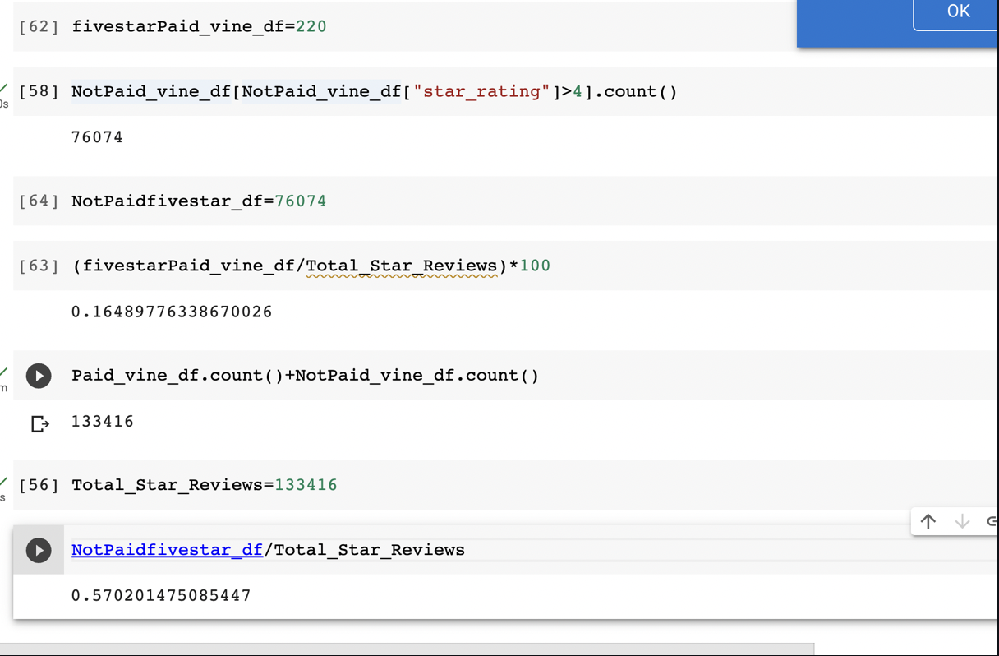

# Amazon_Vine_Analysis  
## Overview of Analysis
The purpose of the analysis was to preform ETL, extract and transform the data using AWS RDS and PG Admin to see if there was any bias towards favorable reviews from Vine members in the data set.  
## Results 

There were many vine reviews and just a few non-vine reviews. Vine reviews=505, and NonVine=132,911.  
Percentage for Vine:1.6% 
Percentage for Non-Vine: 57%  
Vine 5 star reviews total =220 
Non Vine 5 star Reviews= 76074
 
 
 
## Summary 
Based on the analysis above, there is a higher number of individuals in the non vine program that gave 5 stars as reviews. Based on the calculations above I would stop the Vine program since there seems to be more five star reviews from the non vine data. Another analysis I would conduct to support my statement is to see if Vine Program users score higher than Non-Vine. There could be a trend of Vine users rating items lower than non vine. 
