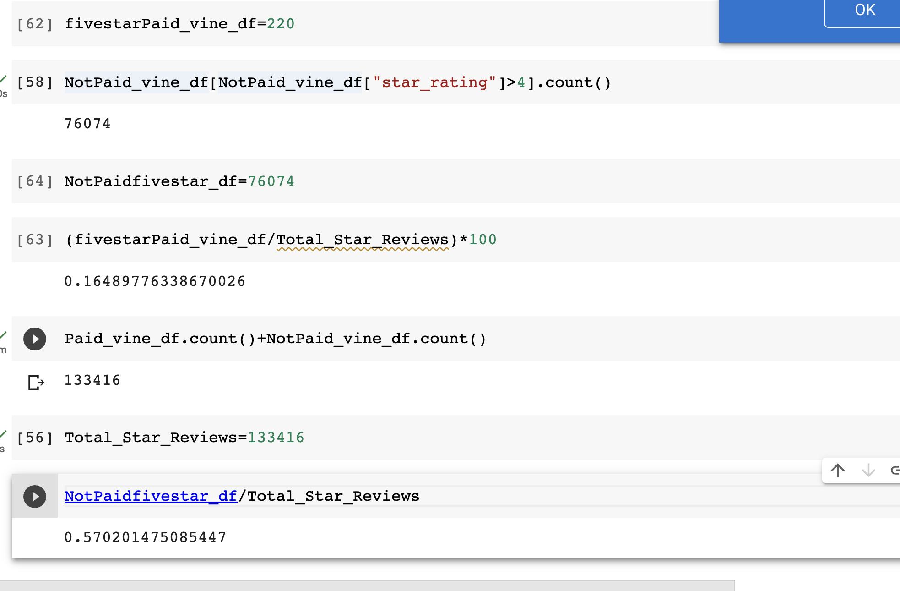

# Amazon_Vine_Analysis  
## Overview of Analysis
The purpose of the analysis was to preform ETL, extract and transform the data using AWS RDS and PG Admin to see if there was any bias towards favorable reviews from Vine members in the data set.  
## Results 
There were many vine reviews and just a few non-vine reviews. Vine reviews=505, and NonVine=132,911.  

